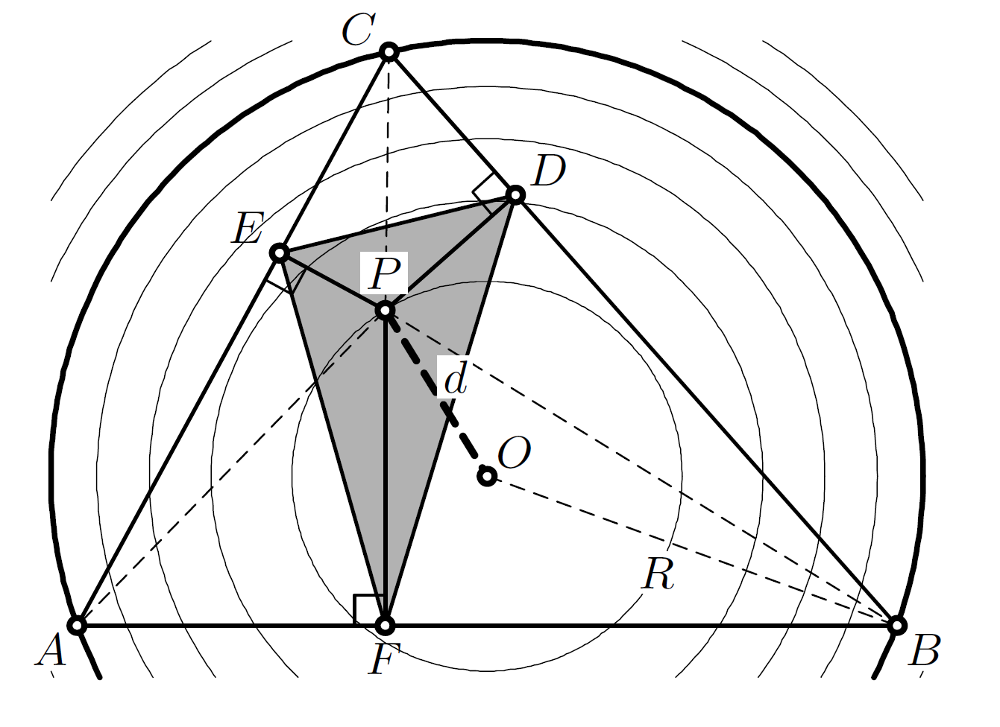

--- 
title: "Extremal Area Pedal and Antipedal Triangles"
author: Mark Helman, Ronaldo Garcia, and Dan Reznik
date: "Last update: `r lubridate::with_tz(Sys.time(),tzone='Brazil/East')`"
output:
  bookdown::html_document2:
      theme: darkly
      highlight: tango
      css: style.css
      toc_depth: 2
      toc: true
      toc_float:
        toc_collapsed: true
        smooth_scroll: yes
      fig_caption: yes
      number_sections: yes
link-citations: yes
bibliography: [references.bib]
csl: computer.csl
---

```{r,echo=F}
knitr::opts_chunk$set(
  cache=T,
  collapse=T,
  comment="#>",
  dpi=300,
  fig.align="center",
  out.width='100%',
  echo=F
)
```

# Introducion

Given a reference triangle $T={V_1}{V_2}{V_3}$ (shown blue below), its *pedal triangle* $T'$ (red) with respect to a point $P$ (called the *pedal point*) is defined by the feet of perpendiculars from $P$ onto the sides of $T$. Additionally, the *antipedal triangle* $T''$ with respect to $P$ (green) has sides through $V_i$ perpendicular to $(V_i-P)$ (its vertices lie at the intersection of said sides) [@mw].

```{r,out.width="60%"}

```

# Sturm's Theorem

In 1823, a then 20 year old Jacques Charles François Sturm (1803-1855), famously known for his Sturm–Liouville theory, proved the following remarkable fact [@ostermann2012]: 

>The isocurves of constant area of the pedal polygon $T'$ are circles centered on the Circumcenter $X_3$.


This is aptly illustrated in Figure 7.31, page 221 in [@ostermann2012], with $O$ representing $X_3$:

```{r,out.width="40%"}

```

Sturm also showed that for each isocircle, the signed area $A'$ of $T'$ is given by:

$$
A'=\frac{A}{4}[1-(\frac{d}{R})^2]
$$

Where $A$ is the area of the reference $T$, and $d,R$ are the radius of the isocircle and $R$ the circumradius, respectively.

Note that when $d<R$ the area is positive. When $d=R$, $P$ is on the circumcircle and pedal degenerates to a zero-area Simson Line [@mw]. For $d>R$, Sturm's pedal area becomes negative, i.e., the triangle's vertices invert order.

It is easy to see that $A$ is maximized at $A/4$ when $d=0$, i.e., $P=X_3$. So the extremal area pedal triangle is the pedal with respect to $X_3$, i.e., the *medial* triangle, with vertices at the midpoint of the sides of $T$.

# Steiner's Curvature Centroid

A short 2 years later, eminent mathematician Jakob Steiner (1796-1863), only 6 years Sturm's senior, generalized Sturm's result to all polygons. He discovered that a special point $K$ called the *Curvature Centroid* (der "Krümmungs-Schwerpunkt") can be computed for any polygon with respect to which the pedal polygons has extremal area [@steiner1838]. Let $V_i,\theta_i$ denote an N-gon vertices and internal angles. $K$ is given by:

$$
K = \frac{\sum_{i=1}^N{\sin(2\theta_i)V_i}}{\sum_{i=1}^N{\sin(2\theta_i)}}
$$

Steiner proves the area will be maximal (resp. minimal) if $sin(2\theta_i)$ is negative or positive.

**Corollary**: the Centroid of Curvature for a triangle is $X_3$, since its barycentrics are $sin(2\theta_i)$, and this confirms Sturm's result.

<!--- TO DO: reference website about constant area-->

## A wrongly-named triangle center?

According to [Mathworld](https://mathworld.wolfram.com/SteinerCurvatureCentroid.html) [@mw], the triangle center with barycentrics $\pi-\theta_i$ was named by Honsberger (1995) "Steiner's Curvature Centroid", listed as $X_{1115}$ on ETC [@etc]. In our view this could be confusing and/or erroneous. Steiner's Curvature Centroid for a triangle is simply $X_3$.

# Minimal-Area Antipedal 

Highly non-linear isocurves of area for the antipedal triangle with respect to points in the plane are shown below for three triangles (acute, right, and obtuse). Note that on the circumcircle the antipoedal triangle shrinks to a point, so its area is zero. The interesting question is where is it extremal?

<!--An elegant theorem appearing in [@gallatly] states that the isogonal conjugate of the antipedal triangle of $T$ with respect to a point $P$ is the antipedal triangle of $T$ with respect to $P^*$, the isogonal conjugate of P.

It is also homothetic with the pedal triangle of DeltaABC with respect to P. Furthermore, the product of the areas of the two homothetic triangles equals the square of the area of the original triangle (Gallatly 1913, pp. 56-58).

A beautiful theorem appearing in [@gallatly]

- X4,X3 is isogonal pair
- since the pedal wrt X3 is maximal, $A'(P) A''(P^*)  = A^2$. since A'(P) is maximal when P=X3, then A''(P^*) must be minimal at X4=isog of X3.
- the minimal antipedal is the anticomplementary triangle.
- the maximal pedal is the medial triangle. -->

```{r}
knitr::include_graphics("pics/poly isoareas heavy graphs v1.png")
```

It turns out the antipedal with respect to the Orthocenter $X_4$ minimizes area. Therefore, the extremal antipedal is the anticomplementary triangle [@mw] and the minimal area is $4A$.

As for any triangle (see above), the antipedal's maximal-area pedal polygon will be its medial, i.e., the original $T$ itself.

# Conclusion

Comments, ideas, corrections, suggestions, and proofs contributed are very welcome. Email me us at: `dreznik _theat_ gmail _thedot_ com`.

***

`r if (knitr::is_html_output()) '# References'`
