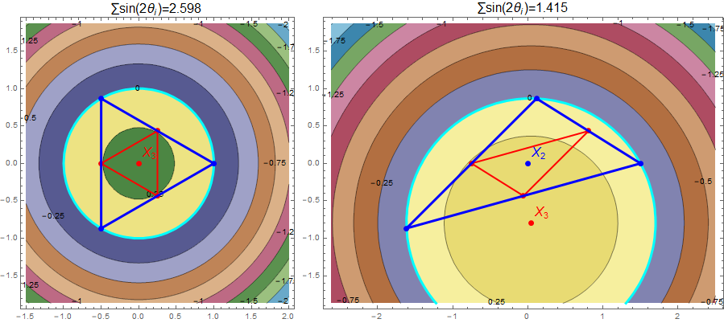
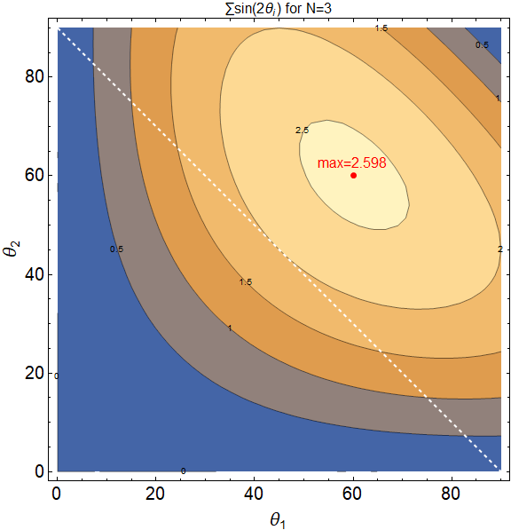
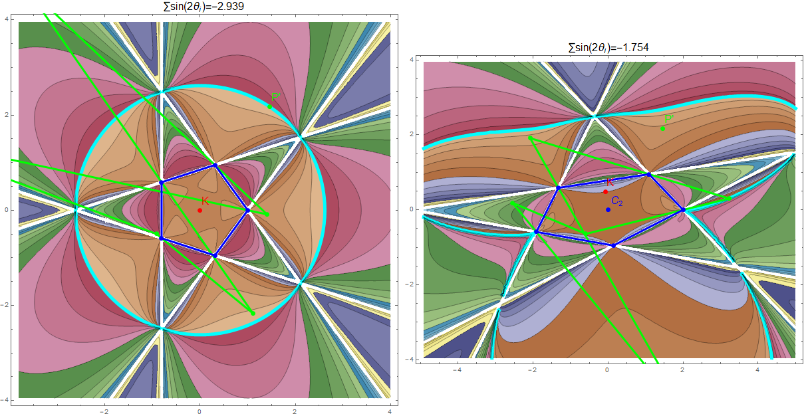

--- 
title: "Extremal Area Pedal and Antipedal Triangles"
author: Mark Helman, Ronaldo Garcia, and Dan Reznik
date: "Last update: `r lubridate::with_tz(Sys.time(),tzone='Brazil/East')`"
output:
  bookdown::html_document2:
      theme: darkly
      highlight: tango
      css: style.css
      toc_depth: 1
      toc: true
      toc_float:
        toc_collapsed: true
        smooth_scroll: yes
      fig_caption: yes
      number_sections: yes
link-citations: yes
bibliography: [references.bib]
csl: computer.csl
---

```{r,echo=F}
knitr::opts_chunk$set(
  cache=T,
  collapse=T,
  comment="#>",
  dpi=300,
  fig.align="center",
  out.width='100%',
  echo=F
)
```

# Introduction

Given a reference triangle $T={V_1}{V_2}{V_3}$ (shown blue below), its *pedal triangle* $T'$ (red) with respect to a point $P$ (called the *pedal point*) is defined by the feet of perpendiculars from $P$ onto the sides of $T$. Additionally, the *antipedal triangle* $T''$ with respect to $P$ (green) has sides through $V_i$ perpendicular to $(V_i-P)$ (its vertices lie at the intersection of said sides) [@mw].

```{r,out.width="60%"}
knitr::include_graphics("pics/pedal and antipedal.png")
```

# Sturm's Theorem

In 1823, a then 20 year old french mathematician Jacques Charles François Sturm (1803-1855), famously known for his Sturm–Liouville theory, proved the following remarkable fact [@ostermann2012]: 

>The isocurves of constant area of the pedal polygon $T'$ are circles centered on the Circumcenter $X_3$.


This is aptly illustrated in Figure 7.31, page 221 in [@ostermann2012], with $O$ representing $X_3$:

```{r,out.width="40%"}
knitr::include_graphics("pics/sturm-ostermann.png")
```

Sturm also showed that for each isocircle, the signed area $A'$ of $T'$ is given by:

$$
A'=\frac{A}{4}[1-(\frac{d}{R})^2]
$$

Where $A$ is the area of the reference $T$, $d$ is the radius of the isocircle, and $R$ the circumradius, respectively. The formula implies that $A'=A/4$ is maximal at $d=0$, i.e., $P=X_3$. So the extremal area pedal triangle is the pedal with respect to $X_3$, i.e., the *medial* triangle, with vertices at the midpoint of the sides of $T$.

Note that when $d<R$ the area is positive (the vertices of both $T$ and $T'$ are ordered alike). At $d=R$, $P$ is on the circumcircle and $T'$ degenerates to a zero-area triangle known as the Simson Line [@mw]. For $d>R$, the vertices of the pedal are in reverse order with respect to $T$ and its signed area becomes negative.

The isocurves of pedal area are depicted below for both regular (left) and obtuse (right) triangles. The circumcircle, where the pedal area is zero is shown cyan

```{r,out.width="80%"}

```

# Steiner's Curvature Centroid

A short 2 years later, eminent swiss mathematician Jakob Steiner (1796-1863), only 6 years Sturm's senior, generalized Sturm's result to all polygons. He discovered a special point $K$ called the *Curvature Centroid* (der "Krümmungs-Schwerpunkt") associated with a polygon with respect to which the pedal polygon has extremal area [@steiner1838]. Let $V_i,\theta_i$ denote an N-gon vertices and internal angles. $K$ is given by:

$$
K = \frac{\sum_{i=1}^N{\sin(2\theta_i)V_i}}{\sum_{i=1}^N{\sin(2\theta_i)}}
$$

**Corollary**: the Centroid of Curvature for a triangle is $X_3$, since its barycentrics are $sin(2\theta_i)$, confirming Sturm's.

Furthermore, Steiner proves the area will be maximal (resp. minimal) if $\sum_i{sin(2\theta_i)}$ is positive (resp.  negative). It turns out that for triangles the sum is always positive and is maximal for equilaterals at $3\sin(2\pi/3)=3\sqrt{3}/2\simeq{2.6}$). So the extremaltriangular pedal (the medial) has maximum area.

Below are depicted the isocurves of the strictly positive sum of double-angle sines for a triangle in the space $\theta_1,\theta_2$. The white line represents the family of right-triangles. 

```{r,out.width="50%"}

```

<!--- TO DO: reference website about constant area-->

## Correcting X(1115)

According to [Mathworld](https://mathworld.wolfram.com/SteinerCurvatureCentroid.html) [@mw], the triangle center with barycentrics $\pi-\theta_i$ was named by Honsberger (1995) "Steiner's Curvature Centroid", listed as $X_{1115}$ on ETC [@etc]. This could be confusing. Steiner's Curvature Centroid for a triangle is simply $X_3$.

Note: as of July 10, 2020, Prof. Clark Kimberling has already changed $X_{1115}$ to *Exterior-Angle Curvature Centroid* [@etc].

## Polygons

For parallelograms, the sum of double-angle sines is zero. Indeed, the area of pedal polygons to this shape is invariant over $P$. 

Depicted below is the case of $N=5$ regular (left) and irregular (right), where $K$ denotes Steiner's Curvature Centroid and $C_2$ the center of area. In the irregular case they don't match. Notice the sum of sines of double angles is negative implying the extremal pedal (shown red) has minimum area.

```{r,out.width="100%"}
knitr::include_graphics("pics/0002_pent_pedals.png")
```

# Antipedal Area

## For a Triangle

It turns out a minimal-area antipedal for a triangle is unique: it is the one with respect to the Orthocenter $X_4$. This is a corollary to the following theorem by Gallatly, page 58 [@gallatly1914]:

>Let $T$ be a triangle and $T'$ its pedal with respect to a point $P$. Let $T^{*}$ be the antipedal of $T$ with respect to $P^*$, the isogonal conjugate of $P$. Let $A,A',A^{*}$ denote the areas of the three mentioned triangles. Then, $A'A^{*}=A^2$.  

Recall $X_4$ is the isogonal conjugate of $X_3$. Suppose another point $Y$ existed with respect to which an antipedal had area lower than $A^*$. With $A$ constant, this would imply a pedal with respect to $Y^*$, the isogonal of $Y$, of area higher than $A'$, a contradiction since $A'$ is maximal.

So the minimal antipedal is the anticomplementary triangle [@mw], whose area is $4A$. As before, the antipedal's maximal-area pedal polygon will be its medial, i.e., the original $T$ itself.

<!--An elegant theorem appearing in [@gallatly] states that the isogonal conjugate of the antipedal triangle of $T$ with respect to a point $P$ is the antipedal triangle of $T$ with respect to $P^*$, the isogonal conjugate of P.

It is also homothetic with the pedal triangle of DeltaABC with respect to P. Furthermore, the product of the areas of the two homothetic triangles equals the square of the area of the original triangle (Gallatly 1913, pp. 56-58).

A beautiful theorem appearing in [@gallatly]

- X4,X3 is isogonal pair
- since the pedal wrt X3 is maximal, $A'(P) A''(P^*)  = A^2$. since A'(P) is maximal when P=X3, then A''(P^*) must be minimal at X4=isog of X3.
- the minimal antipedal is the anticomplementary triangle.
- the maximal pedal is the medial triangle. -->

Shown below are the non-linear isocurves of antipedal triangle area with respect to points in the plane. From left to right: acute, right, and obtuse triangles are shown. The minimal-area antipedal (anticomplementary triangle) is shown green on the first and third plot, as is this triangle's Circumcenter $X_3'$ (reference $X_4$). Note zero-area iso-curves along the circumcircle, where the antipedal triangle shrinks to a point. Also note that for the 2nd case, $X_4$ is on the right angle vertex. 

```{r}
knitr::include_graphics("pics/poly isoareas heavy graphs v1.png")
```

## For a 5-gon

Iso-curves of area for the antipedal of a 5-gon (blue) are shown below. Left shows regular, right irregular. For the regular case we observe a perfectly circular band (shown Cyan) of points with respect to which the antipedal signed area is zero. A sample antipedal with respect to a point on this circle is shown green. For the irregular case, the zero-area band (Cyan) is wavy. For reference, the antipedal polygon (green) with respect to the same point $P'$ in the left case is shown. 

```{r,out.width="100%"}

```

# Conclusion

We salute Sturm, Steiner, and Gallatly for these wonderful results!

Comments, ideas, corrections, suggestions, and proofs contributed are very welcome. Email me us at: `dreznik _theat_ gmail _thedot_ com`.

***

`r if (knitr::is_html_output()) '# References'`
